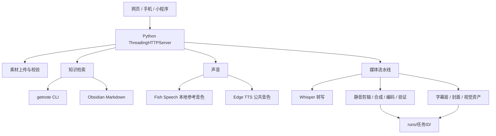

# 系统架构

## 六段流水线



## 任务状态

1. API 校验文件、扩展名、标题、脚本和声音授权。
2. 任务写入 `runs/<job_id>/status.json`，后台线程开始执行。
3. 前端轮询 `/api/jobs/<job_id>`，显示真实进度和错误。
4. 完成后产物通过 `/runs/<job_id>/<file>` 读取。

每个生成任务至少包含：

```text
runs/<job_id>/
├── status.json
├── pipeline.log
├── voice.wav 或 voice.mp3
├── captions.srt
├── project.json
├── contact-sheet.jpg
├── cover.jpg
└── final.mp4
```

## 隐私边界

- `voices/`、`voice-uploads/`、`uploads/`、`runs/` 与 `.env` 均被 Git 忽略。
- Obsidian 连接只读扫描 Markdown；Get 笔记连接只调用检索命令。
- 公网接口可用 `VIDEO_AGENT_API_KEY` 校验，CORS 来源由 `VIDEO_AGENT_ALLOWED_ORIGINS` 控制。
- 声音档案用目录内相对路径，不把用户本机绝对路径写进公开代码。

## 可替换边界

核心任务协议保持简单：输入 JSON，输出可审计的本地文件。需要替换标题模型、图像模型、数字人或发布器时，可在 API 之前或成片之后接入，不需要改动 FFmpeg 的基本交付契约。
