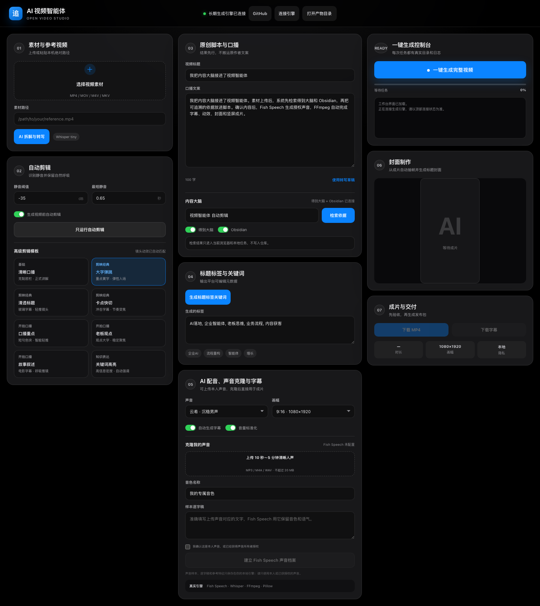
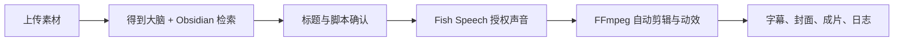

# 颜汝 AI 视频智能体

一套可本地运行、可连接 HTTPS、可在手机使用的开源视频生产工作台。它把知识检索、脚本、授权声音、自动剪辑、字幕、封面和交付证据接进同一个任务流。




## 能跑通什么

- 上传 MP4、MOV、M4V、MKV、AVI 或 WebM 素材。
- 用 Whisper 拆解口播，用 FFmpeg 检测长静音并自动剪辑。
- 同时检索 Get 笔记/得到大脑与本地 Obsidian Markdown 库，返回可追溯来源。
- 上传本人或已获授权的声音，使用 Fish Speech 建立本地声音参考并生成配音。
- 提供八套口播剪辑风格：清晰口播、大字弹跳、清透标题、卡点快切、口播重点、老板观点、故事叙述、知识关键词高亮。
- 自动生成 1080×1920 H.264/AAC 视频、SRT 字幕、封面、接触表、项目 JSON 和任务日志。
- 同一后端供桌面网页、手机网页和原生小程序使用。

## 工作流



## 三分钟本地启动

```bash
git clone https://github.com/yanruwill-dot/yanru-ai-video-agent.git
cd yanru-ai-video-agent
python3 -m venv .venv
source .venv/bin/activate
pip install -r requirements.txt
cp .env.example .env
python3 app.py --host 127.0.0.1 --port 8788
```

打开 `http://127.0.0.1:8788/`。

基础剪辑需要 `ffmpeg` 与 `ffprobe`。macOS 可运行 `brew install ffmpeg`，Debian/Ubuntu 可运行 `sudo apt install ffmpeg`。

## 连接内容大脑

### Obsidian

在 `.env` 填写本地 vault 的绝对路径：

```env
VIDEO_AGENT_OBSIDIAN_VAULT=/absolute/path/to/your/obsidian-vault
```

后端只读扫描 Markdown；路径和笔记正文不会提交到 GitHub。

### Get 笔记 / 得到大脑

安装并登录官方 `getnote` CLI。工作台会调用：

```bash
getnote search "你的主题" --limit 5 -o json
```

检索失败会在界面显示真实原因，系统不会伪造笔记 ID 或搜索结果。

## 配置 Fish Speech

Fish Speech、模型权重和个人声音样本体积较大，也受各自许可证与授权范围约束，因此不打包进本仓库。先按 [Fish Speech 官方仓库](https://github.com/fishaudio/fish-speech) 安装，再配置：

```env
FISH_SPEECH_ROOT=/absolute/path/to/fish-speech
FISH_SPEECH_PYTHON=/absolute/path/to/fish-speech/.venv/bin/python
FISH_SPEECH_CHECKPOINT=/absolute/path/to/fish-speech/checkpoints/fish-speech-1.5
FISH_SPEECH_DEVICE=mps
```

工作台的“克隆”是本地参考音色流程：上传 10 秒到 5 分钟清晰声音、填写准确逐字稿、编码成 Fish Speech 参考特征。它不会训练或上传一个云端模型。请只处理本人声音或已获得明确授权的声音。

许可证请按你实际安装的代码和权重版本逐项核验：当前 Fish Speech 上游采用 Fish Audio Research License，商业使用需另行授权；本项目实测的 1.5 代码提交 `58046ea` 为 Apache-2.0，但 1.5 权重模型卡标注 CC BY-NC-SA 4.0，仅限非商业用途。本仓库的 MIT License 不覆盖这些第三方组件。

Fish Speech 未配置时，公共 Edge Neural TTS 仍可用于基础成片；自定义声音功能会明确显示未配置。

## HTTPS 与桌面长期运行

- `start.command`：本机临时启动。
- `install-persistent.command`：macOS 登录后自动启动，异常退出自动恢复。
- `start-online.command`：本机引擎加 Cloudflare Quick Tunnel，生成本次临时 HTTPS 链接和随机访问密钥。
- `build-desktop-launcher.command`：构建 macOS 桌面启动器。

公网部署必须设置长随机密钥：

```env
VIDEO_AGENT_API_KEY=replace-with-a-long-random-secret
VIDEO_AGENT_ALLOWED_ORIGINS=https://your-ui.example.com
```

Docker 基础版：

```bash
docker build -t yanru-video-agent .
docker run --rm -p 8788:8788 \
  -e VIDEO_AGENT_API_KEY="replace-me" \
  yanru-video-agent
```

容器默认包含 FFmpeg、中文字体、Pillow 与 Edge TTS。Fish Speech 需要另行挂载运行时和模型，GPU/MPS 配置由部署者负责。

## 目录

```text
app.py                 HTTP API、上传、任务队列、产物服务
knowledge.py           Obsidian 与 getnote 只读检索
voice_clone.py         Fish Speech 参考音色和连续配音
pipeline.py            Whisper、FFmpeg、字幕、动效、封面
static/                Apple 风格响应式网页工作台
miniprogram/           原生小程序界面
tests/                 核心逻辑、安全、移动端与 UI 契约测试
runs/                  本地任务产物，已被 .gitignore 排除
voices/                本地声音档案，已被 .gitignore 排除
```

## 测试

```bash
python3 -m unittest discover -s tests -v
python3 -m py_compile app.py pipeline.py voice_clone.py knowledge.py runtime_config.py
node --check static/app.js
```

完整 Fish 推理需要用户自行安装模型；单元测试不会下载模型或读取个人声音。

## 公开版边界

- 仓库不包含颜汝或任何人的声音样本、参考特征、视频素材、知识库正文、平台账号、Cookie、API Key 和运行记录。
- 开源版提供本地知识检索与可编辑脚本工作流，没有内置需要付费的文案模型。
- 自动剪辑目前按静音、字幕与模板节奏工作，不会自动判断一段业务观点是否应该删除。
- 工作台生成发布素材；没有收到明确外发命令时，不会替用户发布到平台。
- 剪辑风格是对公开交互规律的原创实现，不包含商业软件的私有模板、字体或素材。

## License

本项目代码使用 [MIT License](LICENSE)。Fish Speech、FFmpeg、Edge TTS、字体和其他第三方组件遵循各自许可证；模型权重与声音使用权需单独核对。详见 [第三方组件说明](THIRD_PARTY.md)。
